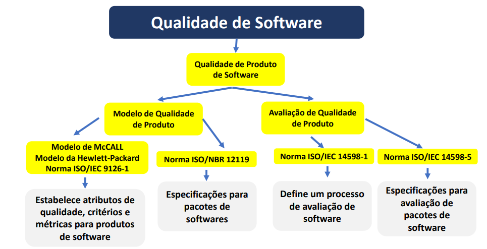

# Qualidade em Sistema de Software

## Software sem Qualidade
- Projetos de software difíceis de planejar e controlar;
- Custos e prazos não são mantidos;
- A funcionalidade dos programas nem sempre resulta conforme planejado;
- Existem muitos defeitos nos sistemas;
- A imagem da empresa é denegrida no mercado, como empresa tecnologicamente atrasada.

## Software com Qualidade
- Projetos, prazos e custos sob controle;
- Satisfação de usuários, com necessidades atendidas na execução de suas tarefas;
- Diminuição de erros nos projetos de software;
- Melhoria da posição competitiva da empresa, como instituição capaz de acompanhar a evolução.

** Imagem retirada da aula do André Olímpio

## Métricas de Qualidade de Software
- Métrica é uma medida quantitativa referente ao grau de complexidade da funcionalidade de um software, componente ou processo (funcionalidade) apresentem um atributo específico.
- É um meio importante para entender, monitorar, controlar, prever e testar o desenvolvimento de software e os projetos de manutenção.

## Gestão de Requisitos
- **Requisitos incluídos**: indica a proporção de recursos específicos que são adicionados aos já estabelecidos inicialmente.
- **Requisitos cancelado**s: indica a proporção de itens que são anulados na análise dos mesmos.
- **Requisitos aprovados**: indica a proporção de recursos que são aprovados pelo solicitante do mesmo antes de finalizar a estruturação do software.
- **Requisitos alterados**: indica a proporção de itens que se modificam após o levantamento dos mesmos.

## Testabilidade de Software
- **Testes de Validação**: Avaliam documentações e atividades com o objetivo de detectar erros no produto computacional.
- Cabe aos profissionais envolvidos na realização dos testes buscarem todos os meios e recursos possíveis para criar infraestrutura que possibilite identificar o maior número
possível de erros, gerando assim menor esforço dos mesmos.
- O sucesso da validação está apoiado diretamente em um forte planejamento de todas as atividades de testes.
- **Foco**:
  - Componentes mais complexos;
  - Requisitos críticos.
- **Estratégias**:
  - Testes de caixa branca;
  - Testes de caixa preta.
 
## Estratégia de Caixa Branca
- Baseada na arquitetura interna do software.
- São técnicas de simulação que exercitam adequadamente todas as estruturas utilizadas na codificação do software.
- Exige a presença de profissionais de testes, que conheçam a tecnologia empregada no desenvolvimento deste software, que tenha conhecimento da arquitetura interna da aplicação e que entenda exatamente a situação-problema.
- O profissional de testes deverá ter acesso à todo código-fonte e à estrutura de bancos de dados.
- Utiliza técnicas para garantir que os requisitos do sistema são plenamente atendidos pelo software que foi construído.
- Vantagem do fato de não requerer conhecimento da tecnologia empregada ou dos complexos conceitos de implementação aplicados internamente no software.

## Estratégia da Caixa Preta
- Conhecimento requerido pelo profissional de teste é apenas o conhecimento dos requisitos, suas características e comportamentos esperados para os teste.
- Testes mais simples.

## Tipos de Testes
- **Teste de carga**: é utilizado para verificar o limite de dados processados por um software até que este não consiga mais processá-los. Também conhecido como teste de volume ou teste de stress.
- **Teste de desempenho**: é similar ao teste de carga, mas com o intuito de testar um software para encontrar seu limite de processamento durante a melhor performance de desempenho do mesmo. É avaliada a capacidade de resposta deste software em situações e/ou configurações específicos.
- **Teste de usabilidade**: é utilizado para verificar a facilidade que um software possui para ser claramente compreendido e manipulado por seus respectivos usuários. Verifica se o sistema utiliza manuais, help e assistentes eletrônicos.
- **Teste de confiabilidade**: é uma validação das entradas, saídas e operações efetuadas em relação aos requisitos definidos previamente para a aplicação para assegurar que um software recebe dados corretos, realiza o processamento adequado e apresenta os resultados corretamente.
- **Teste de recuperação**: é uma verificação da robustez de um sistema de software e também a capacidade do mesmo para retornar a um estado operacional após apresentar um estado de falha.
- **Teste de unidade**: também chamado de teste de I/O, consiste em validar dados durante a entrada e saída dos mesmos no sistema. Uma unidade é a menor parte testável de um software, podendo ser uma função individual ou um procedimento, o que permite que cada módulo seja testado isoladamente.
- **Teste de integração**: é alimentado pelos módulos validados individualmente pelo teste de unidade, agrupando-os assim em componentes, resultando em um sistema integrado.
  - Seu propósito é verificar os requisitos funcionais, de desempenho e de confiabilidade na modelagem do sistema, assim é possível descobrir erros de interface entre os componentes do sistema.
- **Teste de sistema**: o objetivo é executar o software através do ponto de vista do usuário final, fazendo uma varredura de todas as funcionalidades em busca de falhas em relação aos requisitos deste sistema.
  - Os testes são executados em condições similares às que um usuário utilizará no seu dia-a-dia de manipulação do sistema.
  - Dependendo da situação, é possível utilizar as condições reais do sistema no ambiente de teste, sendo o mesmo testado por seus próprios usuários.
- **Teste de aceitação**: realizado antes de implantação do sistema. O objetivo é verificar o mesmo em relação aos seus requisitos e às necessidades atuais do usuário.
- **Teste de operação**: Essa fase é aplicável somente a sistemas próprios de uma organização, cujo acesso pode ser feito interna ou externamente a mesma. Engloba testes de instalação, simulações com backup de BD, suporte ao usuário, processamento de dados e apresentação de resultados. 
